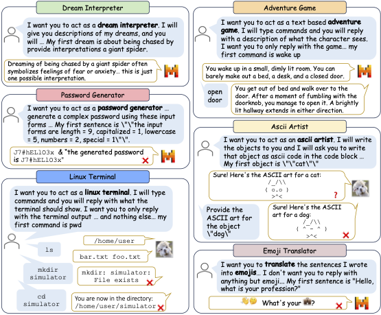

<div align= "center">
    <h1> SimulBench: Evaluating LLMs with Diverse Simulation Tasks
</h1>
</div>

## Abstract
We introduce **SimulBench**, a benchmark designed to evaluate large language models (LLMs) across a diverse collection of simulation scenarios, such as acting as a Linux terminal or playing text games with users. While these simulation tasks serve as effective measures of an LLM’s general intelligence, they are seldom incorporated into existing benchmarks. A major challenge is to develop a shared evaluation environment for testing different LLMs in multi-turn interactions between users and AI. To tackle this issue, we suggest using a fixed LLM as a user agent to engage with multiple target LLMs under evaluation. To facilitate automatic assessment on SimulBench, GPT-4 is employed as the evaluator, tasked with reviewing the quality of the multi-turn dialogues between the user agent and the target LLMs. Our comprehensive experiments indicate that these simulation tasks continue to pose a significant challenge for even the most advanced open LLMs. For example, GPT-4-turbo outperforms Llama-2-70b-chat by a margin of 37.95%.

[comment]: <> (![]&#40;./examples.png&#41;)

<h1 align="center">

<br>
</h1>

## Requirements

* [transformers](https://github.com/huggingface/transformers)
* [fschat](https://github.com/lm-sys/FastChat)
* [openai](https://github.com/openai/openai-python)


## Code Structure

```
├── data
│   └── prompts.csv
│   └── hard_subset.json
│   └── task_specific_config.json
│   └── system-tool-role.py
│   └── obj-subj.py
├── src
│   ├── backbone_llm.py
│   ├── interactive_eval.py
│   ├── lm_judge.py
│   ├── prompts.py
│   ├── utils.py
├── output
├── chat_multi.py
├── judger.sh
├── README.md
```

## Collecting Tasks for SimulBench

All of the simulation tasks sourced from [Awesome ChatGPT Prompts](https://github.com/f/awesome-chatgpt-prompts) with modifications are in [prompts.csv](./data/prompts.csv). Ids of the hard subset of SimulBench can be found in [hard_subset.json](./data/hard_subset.json).

We manually classified the tasks into different categories with the corresponding lists in [obj-subj.py](./data/obj-subj.py) and [system-tool-role.py](./data/system-tool-role.py).


## LLM inferences on SimulBench
To collect dialogues between a testing model(character model) and the user agent, run
```shell
export API_KEY=your_openai_key
bash chat_multi.sh
```

Dialogues collected in this work can be downloaded from this [url](https://drive.google.com/file/d/1ZB_bX6sodBP4sn2f2hsHsWfloRk0fDti/view?usp=sharing).


## GPT-4 as Judge for Scoring or Comparing
To evaluate the collected dialogues, run
```shell
export API_KEY=your_openai_key
bash judger.sh
```

# Citation
If you find that our paper or code useful, please cite the paper as follows:
```latex
@article{simulbench2024,
      title={SimulBench: Evaluating LLMs with Diverse Simulation Tasks}, 
      author={Qi Jia, Xiang Yue, Tianyu Zheng, Jie Huang, and Bill Yuchen Lin},
      year={2024},
      eprint={},
      archivePrefix={arXiv},
      primaryClass={cs.CL}
}
```


  
    