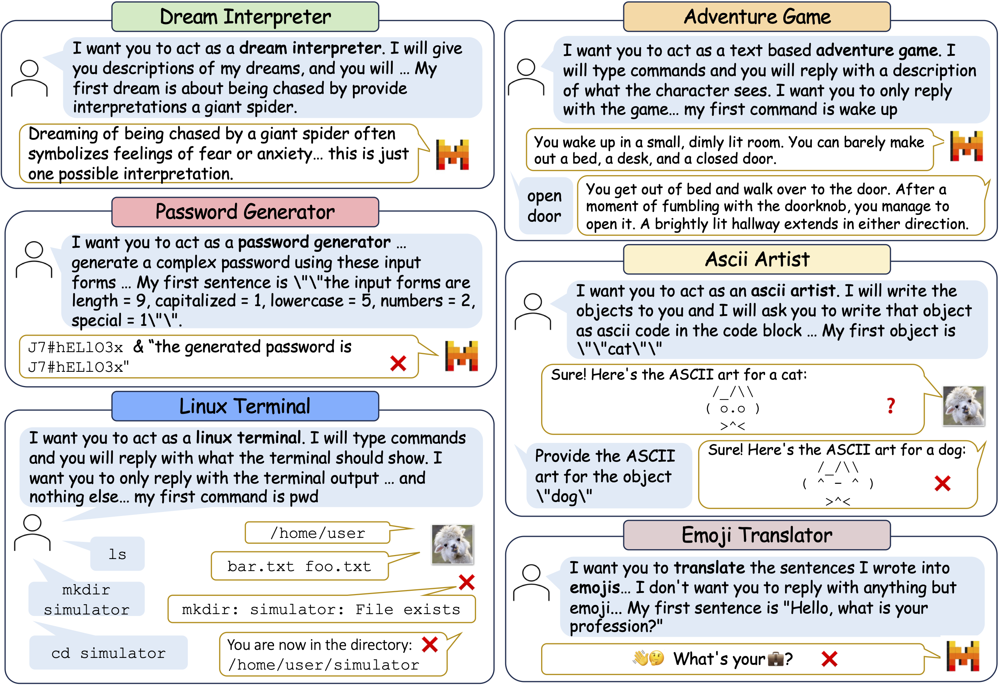

<div align= "center">
    <h1> SimulBench: Evaluating LLMs with Creative Simulation Tasks
</h1>
</div>


<div align= "center">
<p>
<a href="https://xxx">📖 Arxiv</a> |
<a href="https://huggingface.co/datasets/SimulBench/SimulBench">🤗 Dataset</a> |
<a href="https://huggingface.co/spaces/SimulBench/SimulBench">🤗 Data Explorer</a> |
<a href="https://simulbench.github.io/">🌐 Website</a> 
</p>
</div>

[comment]: <> ([📖 Arxiv]&#40;https://xxx&#41; | [🤗 Dataset]&#40;https://huggingface.co/datasets/SimulBench/SimulBench&#41; | [🤗 Data Explorer]&#40;https://huggingface.co/spaces/SimulBench/SimulBench&#41; | [🌐 Website]&#40;https://simulbench.github.io/&#41;)


## Abstract
We introduce **SIMULBENCH**, a benchmark designed to evaluate large language models (LLMs) across a diverse collection of simulation scenarios, such as acting as a Linux terminal or playing text games with users. While these simulation tasks serve as effective measures of an LLM’s general intelligence, they are seldom incorporated into existing benchmarks. A major challenge is to develop an evaluation framework for testing different LLMs fairly while preserving the multi-round interactive nature of simulation tasks between users and AI. To tackle this issue, we suggest using a fixed LLM as a user agent to engage with an LLM to collect dialogues first under different tasks. Then, challenging dialogue scripts are extracted for evaluating different target LLMs. To facilitate automatic assessment on SIMULBENCH, GPT-4 is employed as the evaluator, tasked with reviewing the quality of the final response generated by the target LLMs given multi-turn dialogue scripts. Our comprehensive experiments indicate that these simulation tasks continue to pose a significant challenge with their unique natures and show the gap between proprietary models and the most advanced open LLMs. For example, GPT-4-turbo outperforms LLaMA-3-70b-Chat on 18.55% more cases.

[comment]: <> (![]&#40;./examples.png&#41;)

<h1 align="center">

<br>
</h1>

## Requirements

* [transformers](https://github.com/huggingface/transformers)
* [fschat](https://github.com/lm-sys/FastChat)
* [openai](https://github.com/openai/openai-python)
* [datasets](https://github.com/huggingface/datasets)


## Code Structure

```
├── data
│   └── task_specific_config.jsonl
├── src
│   ├── backbone_llm.py
│   ├── prompts.py
│   ├── utils.py
│   ├── task_generation.py
│   ├── interactive_collection.py
│   ├── script_extraction.py
│   ├── script_based_eval.py
│   ├── lm_judge.py
│   ├── score_calculator.py
├── output
├── output_script
├── chat_collection.sh
├── simulbench_eval.sh
├── judger.sh
├── judger_pairwise.sh
├── README.md
```

## Collecting Simulation Tasks

Based on the seed tasks sourced from [Awesome ChatGPT Prompts](https://github.com/f/awesome-chatgpt-prompts), we manually classified them into three categories and only concentrated on the non-human centered simulation tasks in this work. More diverse simulation tasks are collected with the help of GPT-4 (`./src/task_generation.py`) and checked manually.

The classification of the seed tasks can be find at [SimulBench/SimulBench-seed-tasks](https://huggingface.co/datasets/SimulBench/SimulBench-seed-tasks). And all of the simulation tasks can be loaded from [SimulBench/SimulBench-tasks](https://huggingface.co/datasets/SimulBench/SimulBench-tasks) as follows:
```python
from datasets import load_dataset

simulation_tasks = load_dataset("SimulBench/SimulBench-tasks", split="test")
```

## Collecting LLM Interactions and Extracting Test Scripts
To collect dialogues between ChatGPT and the user agent, run
```shell
export API_KEY=$YOUR_OPENAI_KEY
bash chat_collection.sh
```

The dialogues we collected in this work are in [SimulBench/SimulBench_interactions](https://huggingface.co/datasets/SimulBench/SimulBench_interactions). Then, challenging test scripts can be extracted with the code from `script_extract.py`.

The current version of SimulBench dataset made up of testing scripts can be found from [huggingface/datasets](https://huggingface.co/datasets/SimulBench/SimulBench). It can be loaded simularly as follows:
```python
from datasets import load_dataset

simulation_tasks = load_dataset("SimulBench/SimulBench-tasks", "all", split="test")
```
Other available subsets of SimulBench include: `hard`, `stateful`, `stateless`, `lastonly`, `firstchan`, `subseqchan`.

## LLM inferences on SimulBench

You can test a model on SimulBench by running
```shell
export API_KEY=your_openai_key
bash simulbench_eval.sh
```

To test your own model, please modify `--character_model` and `--character_template_name` in [chat_multi.sh](https://github.com/SimulBench/SimulBench/blob/main/chat_multi.sh). Available templates or registration for a new template please refer to [FastChat](https://github.com/lm-sys/FastChat/blob/main/fastchat/conversation.py).


## GPT-4 as Judge for Scoring or Comparing
You can scoring the model's response directly by simply specifying the parameter `--judger_api_key` in `simulbench_eval.sh`.

Evaluating the models' performance alone is also available by running
```shell
export API_KEY=your_openai_key
bash judger.sh
bash judger_pairwise.sh
```
for scoring and pairwise comparisons resplectively.

## Scores for different models on SimulBench subsets
To calculate the average scores for different models on a simulbench subset, you can either load the outputs from your local directory:
```shell
python3 src/score_calculator.py --output_dir local_output_dir --model_name test_model_name --subset all
```

or load the collected outputs from huggingface/datasets:
```shell
python3 src/score_calculator.py --model_name test_model_name --subset all
```

All of LLMs' generations collected in this work including the GPT-4 Judge's output can be found in [SimulBench/SimulBench-results](https://huggingface.co/datasets/SimulBench/SimulBench-results).


# Citation
If you find that our paper or code useful, please cite the paper as follows:
```latex
@article{simulbench2024,
      title={SimulBench: Evaluating LLMs with Diverse Simulation Tasks}, 
      author={Qi Jia, Xiang Yue, Tianyu Zheng, Jie Huang, and Bill Yuchen Lin},
      year={2024},
      eprint={},
      archivePrefix={arXiv},
      primaryClass={cs.CL}
}
```


  
    
